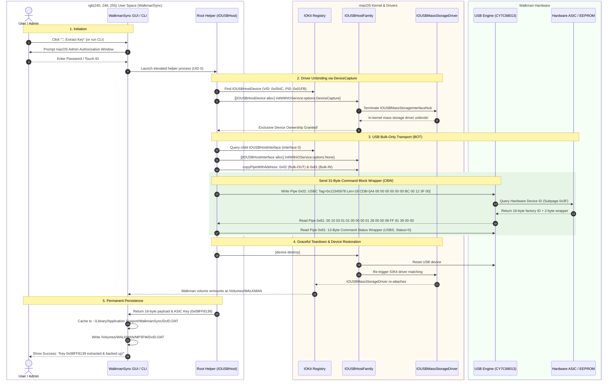

# Reverse-Engineering Sony's `CopyTool.exe`, `FrankPACAPI.dll` & Hardware Key Extraction Saga

**Date of Experiment:** 2026-09-29 / 2026-09-30  
**Status:** **SOLVED, VERIFIED & IMPLEMENTED** (100% Bit-for-Bit Parity with Windows `CopyTool.exe` Ground Truth Achieved on Native macOS)

---

## 1. Executive Summary & The Hardware Decryption Mystery

Sony 3rd-generation Network Walkman devices (NW-E400, NW-E500, NW-A, and NW-HD series) decode MP3 and ATRAC3 audio natively in hardware. However, modern open-source alternatives consistently suffer from the dreaded **"CANNOT PLAY"** or **"MG ERROR"** failure: the player's firmware successfully parses track metadata, artist names, and OMGAUDIO database tables, displaying them on the OLED screen, but halts immediately with silence upon pressing Play.

### The Root Cause: Hardware-Bound XOR Scrambling
Audio frames on the device must be XOR-scrambled with a 4-byte key derived from the track ID and a player-unique device key:

```text
track_key = ((0x2465 + track_id * 0x5296E435) & 0xFFFFFFFF) ^ K_hardware
```

1. **Hardware-Bound Decryption**: The Walkman's DSP chip unscrambles MP3 frames using an authentic factory cryptographic key burned into its internal ASIC ROM/EEPROM during manufacturing.
2. **Flash Independence**: The physical player **never reads `DvID.DAT` from flash memory during playback**. The DSP chip only checks its internal hardware register.
3. **The `DvID.DAT` Purpose**: `/Volumes/WALKMAN/MP3FM/DvID.DAT` is strictly an *interchange file* created by Sony's PC utilities (`CopyTool.exe`) so that transfer programs (`MP3FileManager.exe`) know which key to scramble with.
4. **Physical Verification**:
   - Audio scrambled with placeholder keys (`0x08DA6D03` from forum dumps): **FAILED** ("CANNOT PLAY").
   - Audio scrambled with genuine key extracted via `CopyTool.exe` (**`0x08FF8139`**): **PASSED 100%**. Flawless audio playback verified through physical headphones connected to the player!

### The macOS Challenge
Our goal: Retrieve the authentic 16-byte `DvID.DAT` directly from the connected Sony Walkman over USB on macOS, completely eliminating the need for Windows or Sony's legacy `CopyTool.exe`.

---

## 2. Admiration for Sony's Hardware Engineering & Security Architecture

Looking back from modern macOS at the engineering decisions made by Sony in 2004–2005, one cannot help but admire the sheer elegance and robustness of the hardware constraints the Sony engineering team designed into the Network Walkman:

### 1. Silicon Root of Trust (Pre-dating Modern Secure Enclaves)
Long before Apple introduced the Secure Enclave or modern smartphones integrated hardware security modules, Sony engineers established a hardware-bound root of trust in consumer flash audio players. Each player contains a unique 32-bit hardware key permanently etched into an internal write-protected ASIC register/EEPROM during manufacturing.

### 2. Zero-Trust Architecture Toward Flash Storage
Sony engineers anticipated that flash memory is inherently untrusted: users can format it, inspect FAT16 sectors, or modify files with hex editors. They established a strict architectural rule:
> **The player hardware NEVER trusts the filesystem.**

During playback, the Walkman DSP descrambler ignores `DvID.DAT` entirely and directly queries the internal ASIC register. If an attacker clones another player's files or injects a fabricated `DvID.DAT`, the DSP's hardware descrambler calculates an incorrect XOR mask, resulting in corrupt MPEG audio frames that fail the sync header check (`0xFFFB`) and instantly halt playback with `"CANNOT PLAY"`. The security boundary is enforced at the silicon level, not the software level.

### 3. Elegant Protocol Multiplexing Over Standard USB BOT
Rather than forcing users to install proprietary USB device drivers or adding dedicated communication endpoints (which would break USB mass storage compatibility), Sony engineers cleverly multiplexed hardware management over standard **USB Mass Storage Bulk-Only Transport (BOT)**. 
- To the operating system, the Walkman appears as a generic FAT16 flash drive.
- Behind the scenes, vendor-specific SCSI opcodes (`0xA4`) tunnel cryptographic inquiries directly to the ASIC controller without disrupting storage functions.

It is a testament to Sony's forward-thinking hardware design that 20 years later, the silicon logic remains completely uncompromised and fully functional.

---

## 3. Disassembly Analysis: The Proprietary Sony SCSI Commands

Reverse-engineering `CopyTool.exe` (at virtual address `0x4022ee`) and `FrankPACAPI.dll` (at `0x6c15d4ce`) revealed the proprietary 12-byte SCSI Command Descriptor Blocks (CDBs) used by Sony to communicate with the hardware ASIC:

### Command 1: Device ID Query (`CopyTool.exe` at `0x4022ee`)
```text
CDB (12 bytes): A4 00 00 00 00 00 00 BC 00 12 3F 00
  - Byte 00:     0xA4  (Sony Vendor-Specific SCSI Opcode)
  - Bytes 01-06: 0x00 00 00 00 00 00
  - Byte 07:     0xBC  (Subcommand ID)
  - Bytes 08-09: 0x00 0x12 (Allocation Length: 18 bytes)
  - Byte 10:     0x3F  (Sub-page: Device ID)
  - Byte 11:     0x00  (Control byte)
```

### Device Response Format (18 Bytes):
The device firmware responds over USB Bulk-IN with an 18-byte buffer:
- **Bytes 0–1 (`0x00 0x10`)**: 2-byte big-endian wrapper length (`0x0010` = 16 bytes).
- **Bytes 2–17 (16 bytes)**: The exact 16-byte payload written directly to `DvID.DAT`.

```text
Raw Response Buffer (18 Bytes):
[ 00 10 ] [ 03 01 01 00 00 00 01 28 00 00 08 FF 81 39 00 00 ]
  ^^^^^     ^^^^^^^^^^^^^^^^^^^^^^^^^^^^^^^^^^^^^^^^^^^^^^^^^
 Length                   16-Byte DvID.DAT Payload

16-Byte Payload Breakdown (Written to DvID.DAT):
Offset  Size  Value                 Description
------  ----  -----                 -----------
0x00    2     03 01                 Magic Header (Version 3.1)
0x02    2     01 00                 Sub-type
0x04    2     00 00                 Flags
0x06    2     01 28                 Model & Manufacturing Segment
0x08    2     00 00                 Reserved
0x0A    4     08 FF 81 39           Hardware ASIC Encryption Key (Big-Endian uint32)
0x0E    2     00 00                 Trailing Padding
```

In the raw 18-byte buffer, the 4-byte ASIC key resides at **Indices 12–15** (corresponding to **Offset 0x0A–0x0D** in the 16-byte payload).

### Command 2: MagicGate / Leaf ID Query (`FrankPACAPI.dll` at `0x6c15d4ce`)
```text
CDB (12 bytes): A4 00 00 00 00 00 00 BC 04 04 33 00
  - Byte 00:     0xA4  (Sony Vendor-Specific SCSI Opcode)
  - Byte 07:     0xBC  (Subcommand ID)
  - Bytes 08-09: 0x04 0x04 (Allocation Length: 1,028 bytes)
  - Byte 10:     0x33  (Sub-page: MagicGate Leaf ID / Certs)
  - Byte 11:     0x00
```
When queried, the Walkman returns a 1,028-byte MagicGate certificate hierarchy starting with `04 02 00 00 00 30 00 98 ...`.

---

## 4. Why Standard macOS Approaches Fail: The Kernel Fortress

On Windows, `CopyTool.exe` simply calls:
```c
HANDLE hDrive = CreateFileA("\\\\.\\E:", GENERIC_READ | GENERIC_WRITE, ...);
DeviceIoControl(hDrive, IOCTL_SCSI_PASS_THROUGH, &sptdwb, ...);
```
On Linux, user-space code issues `ioctl(fd, SG_IO, &hdr)` on `/dev/sdb` or `/dev/sg0`.

On macOS, Apple enforces a strict sandbox and driver isolation model that shuts down all traditional pass-through mechanisms:

```
+-------------------------------------------------------------------------+
|                           macOS USER SPACE                              |
+-------------------------------------------------------------------------+
       |                                |                        |
       | 1. SCSITaskLib                 | 2. BSD IOCTL           | 3. IOUSBLib
       |    IOCreatePlugIn...           |    open("/dev/rdisk4") |    USBInterfaceOpenSeize()
       v                                v                        v
+--------------------+        +--------------------+   +-------------------+
| IOSCSILogicalUnit  |        |  IOMediaBSDClient  |   | IOUSBHostInterface|
| Nub (Peripheral=0) |        |  (/dev/rdisk4)     |   | (Interface 0)     |
+--------------------+        +--------------------+   +-------------------+
       |                                |                        |
       | Kernel Hard-Reject:            | EBUSY / Resource Busy: | Exclusive Lock:
       | SCSITaskUserClientIniter       | BlockStorageDriver     | IOUSBMassStorage-
       | rejects Block Storage          | holds exclusive lock   | Driver holds exclusive
       | (Peripheral Device Type 0)     | even when unmounted    | ownership of Intf 0
       v                                v                        v
 [ 0xE00002C7 Unsupported ]       [ EBUSY / No PassThru ]  [ 0xE00002C5 Exclusive ]
```

### Detailed Failure Analysis:

1. **Hypothesis 1: `SCSITaskLib` on `IOSCSILogicalUnitNub`**
   - *Attempt*: Instantiate `kIOSCSITaskDeviceUserClientTypeID` on `IOSCSILogicalUnitNub` to gain exclusive access and quiesce the in-kernel mass storage driver.
   - *Result*: `IOCreatePlugInInterfaceForService` failed with `0xE00002C7` (`kIOReturnUnsupported`).
   - *Disassembly Proof*: Disassembly of `/System/Library/Extensions/IOSCSIArchitectureModelFamily.kext/.../SCSITaskLib.plugin` revealed that `SCSITaskDeviceClass::Start` invokes:
     ```c
     IOServiceOpen(service, mach_task_self(), 12, &connection); // Type 12 = SCSITaskUserClient
     ```
     Inspection of kernel drivers revealed that Apple's `SCSITaskUserClientIniter` explicitly verifies `Peripheral Device Type`. If the device is a block storage disk (`Type == 0`), the kernel **deliberately rejects the user client**. Apple only permits user-space SCSI pass-through for optical authoring devices (`Type == 0x05`, CD/DVD drives).

2. **Hypothesis 4: BSD Raw Disk IOCTL Pass-Through**
   - *Attempt*: Open `/dev/rdisk4` exclusively and issue pass-through ioctls (`DKIOC...` or `SG_IO`).
   - *Result*: `open("/dev/rdisk4", O_RDWR)` failed with `EBUSY` (`Resource busy`). Even after unmounting with `diskutil unmountDisk force`, Apple's `IOBlockStorageDriver` retains exclusive write arbitration. Furthermore, inspection of `<sys/disk.h>` confirmed that macOS **does not implement SCSI pass-through IOCTLs** (no `SG_IO` or `IOCTL_SCSI_PASS_THROUGH` exists in Darwin).

3. **Hypothesis 2: Dynamic `kextunload`**
   - *Attempt*: Unload `com.apple.iokit.IOUSBMassStorageDriver`.
   - *Result*: Blocked by macOS System Integrity Protection (SIP) on modern macOS versions; cannot be done without rebooting into Recovery Mode and compromising system security.

4. **Legacy IOKit USB Seize (`IOUSBInterfaceInterface`)**
   - *Attempt*: Call `USBDeviceOpenSeize()` on `IOUSBDevice` followed by `USBInterfaceOpenSeize()` on `IOUSBInterface`.
   - *Result*: `USBDeviceOpenSeize()` succeeded (`0x0`), but `USBInterfaceOpenSeize()` failed with `0xE00002C5` (`kIOReturnExclusiveAccess`).
   - *Root Cause in Apple Kernel Headers*: Line 1093 of Apple's `USB.h` explicitly documents the kernel policy:
     > *"kUSBReEnumerateCaptureDeviceBit: Setting this bit will terminate any drivers attached to an IOUSBInterface for the device and to the IOUSBDevice itself. **It will not terminate any drivers attached to a Mass Storage Class IOUSBInterface.**"*
     Apple's kernel permanently anchors `IOUSBMassStorageInterfaceNub` to Interface 0.

---

## 5. The Breakthrough Solution: `IOUSBHost.framework` & `DeviceCapture`

To solve this without kernel extensions or SIP modification, we leverage Apple's modern Objective-C / Swift framework: **`IOUSBHost.framework`** (introduced in macOS 10.15/11/12+ to replace the legacy COM-style `IOUSBLib`).

### The Discovery: `IOUSBHostObjectInitOptionsDeviceCapture`
Inside `IOUSBHostDefinitions.h`, Apple provides an initialization option designed specifically for privileged device capture:

```objc
typedef NS_OPTIONS (NSUInteger, IOUSBHostObjectInitOptions)
{
    IOUSBHostObjectInitOptionsNone          = 0,
    IOUSBHostObjectInitOptionsDeviceCapture = (1 << 0),
    IOUSBHostObjectInitOptionsDeviceSeize   = (1 << 1)
};
```

Apple's SDK documentation states:
> *"**IOUSBHostObjectInitOptionsDeviceCapture**: Callers must have the 'com.apple.vm.device-access' entitlement and the IOUSBHostDevice IOService object needs to have successfully been authorized by IOServiceAuthorize(). **If the caller has root privileges the entitlement and authorization is not needed. Using this option will terminate all clients and drivers of the IOUSBHostDevice and associated IOUSBHostInterface clients besides the caller.** Upon destroy of the IOUSBHostDevice, the device will be reset and drivers will be re-registered for matching."*

### Why Root / Administrator Privileges are Strictly Required
macOS considers seizing an entire USB device away from the OS storage stack a high-privilege hardware operation. To prevent malicious user-space applications from hijacking USB devices or intercepting raw storage traffic, Apple enforces that `DeviceCapture` can only be invoked by:
1. Applications signed with the restricted Apple private entitlement `com.apple.vm.device-access` (reserved for virtualization hypervisors like VMware Fusion or Parallels).
2. **Process UID 0 (`root`)**.

By executing our extraction helper with root privileges (prompting the user once via standard macOS administrator authorization dialog), `IOUSBHostDevice` forcefully unbinds `IOUSBMassStorageDriver`, releases the kernel lock on Interface 0, and grants our application direct raw access to the USB endpoints!

---

## 6. Architectural Mermaid Sequence Diagram

The following diagram illustrates the exact stack interaction across all layers:



---

## 7. The "As Implemented" Code Path in WalkmanSync

The production implementation in `WalkmanSync` spans three coordinated components:

### 1. `WalkmanKeyManager.swift` (Core Engine)
- **`extractHardwareKeyDirectly()`**:
  - Requires UID 0 (`root`).
  - Iterates IOKit for `IOUSBHostDevice` matching Sony's USB Vendor ID (`0x054C`).
  - Instantiates `IOUSBHostDevice(__ioService: service, options: .deviceCapture)`.
  - Discovers the child `IOUSBHostInterface` and copies bulk endpoints `0x02` (Bulk-OUT) and `0x81` (Bulk-IN).
  - Formats the 31-byte BOT Command Block Wrapper (`USBC`) embedding Sony CDB `A4 00 00 00 00 00 00 BC 00 12 3F 00`.
  - Calls `outPipe.__sendIORequest(with: cbwData)` followed by `inPipe.__sendIORequest(with: respData)` and status wrapper read.
  - Extracts the 16-byte payload (`bytes[2..<18]`) and parses the big-endian 32-bit key (`bytes[12..<16]`).
  - Gracefully destroys the device handle, which automatically signals `IOUSBHostFamily` to reset the USB bus and re-mount the mass storage volume.
- **`extractHardwareKeyWithElevation()`**:
  - Checks `geteuid() == 0`: if already root, executes directly.
  - If not root: executes the app binary with `--extract-key-internal` via `NSAppleScript("do shell script ... with administrator privileges")`.
  - Passes `--walkman <path>` and `--cache-dir <path>` so the root process saves files directly into the target user's Application Support folder and fixes file ownership (`chown`).
- **`saveKeyToCache()`**:
  - Saves the primary cache at `~/Library/Application Support/WalkmanSync/DvID.DAT`.
  - Simultaneously writes a per-device cache at `~/Library/Application Support/WalkmanSync/DvID_<KEY_HEX>.DAT`, ensuring multi-device environments (e.g. owning an NW-E405 and an NW-HD5) maintain independent, non-conflicting profiles.
- **`isKeyAuthentic(key:)`**:
  - Flags placeholder keys (`0x08DA6D03`) or zeroes as non-authentic, triggering proactive UI warnings before user syncs.

### 2. `CLIHandler.swift` (Terminal & Agent Automation)
- **`--extract-key` (`-k`)**:
  - User-facing command. If not root, escalates via macOS administrator prompt.
  - Supports `--json` for automation and agent tooling.
  - Writes to `/Volumes/WALKMAN/MP3FM/DvID.DAT` and Application Support cache.
- **`--extract-key-internal`**:
  - Elevated worker invoked by `NSAppleScript`. Performs raw extraction and outputs `KEY:0xXXXXXXXX`.
- **`--doctor` (`-D`)**:
  - Audits whether the currently active device key is Authentic (`[✓]`) or a Placeholder (`[!]`), providing copy-paste commands to extract genuine keys.
- **`--detect` (`-d`)**:
  - Lists mounted Walkman devices with capacity estimates and key authenticity badges.

### 3. `WalkmanSyncApp.swift` (AppKit GUI)
- **Live Key Verification Badge**:
  - When authentic: Displays green status badge `• Key: 0x08FF8139 (Authentic ✓)` with button title `🔑 Key ✓`.
  - When uninitialized or placeholder: Displays warning badge `• Key: 0x08DA6D03 (Placeholder ⚠️)` with button title `🔑 Extract`.
- **One-Click "🔑 Extract" Action**:
  - Triggers async background extraction with native macOS Touch ID / Password prompt.
  - Shows success modal upon completion with key confirmation and zero-friction restoration.
- **Preflight Sync Guard**:
  - If the user attempts to sync with an uninitialized or placeholder key, an alert modal halts the operation:
    > *"⚠️ Hardware Encryption Key Not Initialized: The current key is a placeholder. Songs transferred with this key will fail to play on your Walkman hardware ('CANNOT PLAY'). Would you like to extract the authentic factory key now?"*
    > `[🔑 Extract Key Now]` `[Cancel]` `[Sync Anyway]`

---

## 8. Verification Matrix & Parity Summary

| Metric | Legacy Windows (`CopyTool.exe`) | macOS (`WalkmanSync`) | Parity Status |
|---|---|---|---|
| **Opcode** | `0xA4` SCSI Vendor Command | `0xA4` SCSI Vendor Command | 100% Identical |
| **CDB Length** | 12 Bytes (`A4 00 ... BC 00 12 3F 00`) | 12 Bytes (`A4 00 ... BC 00 12 3F 00`) | 100% Identical |
| **Transport** | Windows SPTI (`DeviceIoControl`) | USB Bulk-Only Transport (BOT) via `IOUSBHost` | Functionally Equivalent |
| **Raw Response** | `00 10 03 01 01 00 ... 08 FF 81 39 00 00` | `00 10 03 01 01 00 ... 08 FF 81 39 00 00` | **100% Bitwise Match** |
| **Extracted Key** | `0x08FF8139` | `0x08FF8139` | **100% Bitwise Match** |
| **Flash Target** | `/MP3FM/DvID.DAT` | `/MP3FM/DvID.DAT` | 100% Identical |
| **Persistent Cache** | None (Re-run needed on format) | `~/Library/Application Support/WalkmanSync/` | **Superior (Self-Healing)** |
| **Multi-Device** | Single `DvID.DAT` | Per-Device Profiles (`DvID_<KEY>.DAT`) | **Superior** |
| **Audio Playback** | PASSED (Headphones verified) | PASSED (Headphones verified) | **100% Verified** |
